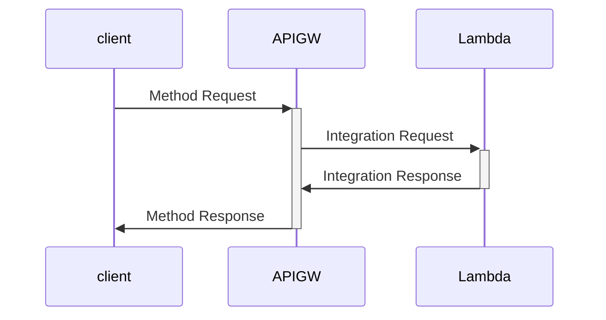

# Day3

## APIGWのインターフェース仕様を知る




### Method Request / Response

- クライアント / APIGW間 のデータのインターフェース仕様を定義する
- 例えば 前回作った OpenAPI をそのまま設定することができる。
-　たとえば `/order` というパスに、GETでリクエストする口が開くことになる。
- パスやクエリパラメータ・リクエストボディだけでなく、認証に関する情報も定義することができる。
  - 例えば `Authorization` や `x-api-key` といったヘッダがないと、認証エラーすることもできる。


### Integration Request / Response

- APIGW / Lambda 間のデータのインターフェース仕様を定義する。
- Lambdaの本体である `main.py` を見てみると、次のような形式になっている。

```py
from aws_lambda_powertools.event_handler import ALBResolver
from aws_lambda_powertools.utilities.typing import LambdaContext
from router import order_router

app = ALBResolver()

app.include_router(order_router, prefix="/order")


def lambda_handler(event: dict, context: LambdaContext) -> dict:
    return app.resolve(event, context)
```


- main.pyの中の `lambda_handler` が実行時に呼び出される。
- この引数である `event`, `context` をAPIGWが生成し、Integration RequestとしてLambdaに渡している。


- 逆に Integration Requestは、Lambdaが APIGWに対して返す値で、実際のコードを見ると以下のようになっている。

```py
@router.get("")
def get_order():
    event = router.current_event
    path_parameters: OrderPathParameter = parse(
        model=OrderPathParameter, event=event, envelope=ApiGatewayPathParameterEnvelope
    )
    query_parameters: OrderQueryParameter = parse(
        model=OrderQueryParameter,
        event=event,
        envelope=ApiGatewayQueryParameterEnvelope,
    )
    # この部分
    return jsonable_encoder(query_parameters)
```


- APIGWにはJSONが渡され、APIGWはそれを Method Response としてクライアントに返す。


## 必須知識: Integration Request における eventの中身

- Integration Request で Lambdaの引数が渡されることがわかったが、それをLambdaで利用するためには渡されるデータの仕様を知っておく必要がある。
- 以下の形式のdictが、 `event` という変数に入ってくる。

```py
def base_event():
    return {
        "resource": "/",
        "path": "/",
        "httpMethod": "GET",
        "headers": {
            "accept": "text/html,application/xhtml+xml,application/xml;q=0.9,image/webp,image/apng,*/*;q=0.8,application/signed-exchange;v=b3;q=0.9",
            "accept-encoding": "gzip, deflate, br",
            "accept-language": "en-US,en;q=0.9",
            "cookie": "s_fid=7AAB6XMPLAFD9BBF-0643XMPL09956DE2; regStatus=pre-register",
            "Host": "70ixmpl4fl.execute-api.us-east-2.amazonaws.com",
            "sec-fetch-dest": "document",
            "sec-fetch-mode": "navigate",
            "sec-fetch-site": "none",
            "upgrade-insecure-requests": "1",
            "User-Agent": "Mozilla/5.0 (Windows NT 10.0; Win64; x64) AppleWebKit/537.36 (KHTML, like Gecko) Chrome/80.0.3987.132 Safari/537.36",
            "X-Amzn-Trace-Id": "Root=1-5e66d96f-7491f09xmpl79d18acf3d050",
            "X-Forwarded-For": "52.255.255.12",
            "X-Forwarded-Port": "443",
            "X-Forwarded-Proto": "https",
        },
        "multiValueHeaders": {
            "accept": [
                "text/html,application/xhtml+xml,application/xml;q=0.9,image/webp,image/apng,*/*;q=0.8,application/signed-exchange;v=b3;q=0.9"
            ],
            "accept-encoding": ["gzip, deflate, br"],
            "accept-language": ["en-US,en;q=0.9"],
            "cookie": [
                "s_fid=7AABXMPL1AFD9BBF-0643XMPL09956DE2; regStatus=pre-register;"
            ],
            "Host": ["70ixmpl4fl.execute-api.ca-central-1.amazonaws.com"],
            "sec-fetch-dest": ["document"],
            "sec-fetch-mode": ["navigate"],
            "sec-fetch-site": ["none"],
            "upgrade-insecure-requests": ["1"],
            "User-Agent": [
                "Mozilla/5.0 (Windows NT 10.0; Win64; x64) AppleWebKit/537.36 (KHTML, like Gecko) Chrome/80.0.3987.132 Safari/537.36"
            ],
            "X-Amzn-Trace-Id": ["Root=1-5e66d96f-7491f09xmpl79d18acf3d050"],
            "X-Forwarded-For": ["52.255.255.12"],
            "X-Forwarded-Port": ["443"],
            "X-Forwarded-Proto": ["https"],
        },
        "queryStringParameters": None,
        "multiValueQueryStringParameters": None,
        "pathParameters": None,
        "stageVariables": None,
        "requestContext": {
            "resourceId": "2gxmpl",
            "resourcePath": "/",
            "httpMethod": "GET",
            "extendedRequestId": "JJbxmplHYosFVYQ=",
            "requestTime": "10/Mar/2020:00:03:59 +0000",
            "path": "/Prod/",
            "accountId": "123456789012",
            "protocol": "HTTP/1.1",
            "stage": "Prod",
            "domainPrefix": "70ixmpl4fl",
            "requestTimeEpoch": 1583798639428,
            "requestId": "77375676-xmpl-4b79-853a-f982474efe18",
            "identity": {
                "cognitoIdentityPoolId": None,
                "accountId": None,
                "cognitoIdentityId": None,
                "caller": None,
                "sourceIp": "52.255.255.12",
                "principalOrgId": None,
                "accessKey": None,
                "cognitoAuthenticationType": None,
                "cognitoAuthenticationProvider": None,
                "userArn": None,
                "userAgent": "Mozilla/5.0 (Windows NT 10.0; Win64; x64) AppleWebKit/537.36 (KHTML, like Gecko) Chrome/80.0.3987.132 Safari/537.36",
                "user": None,
            },
            "domainName": "70ixmpl4fl.execute-api.us-east-2.amazonaws.com",
            "apiId": "70ixmpl4fl",
        },
        "body": None,
        "isBase64Encoded": False,
    }
```

- 一見膨大な情報に見えるが、実際に使うのは一部のフィールドのみ
  - `path`: パス
  - `pathParameters`: パスパラメータ
  - `queryStringParameters`: クエリパラメータ
  - `multiValueQueryStringParameters`: 配列形式のクエリパラメータ
  - `body`: リクエストボディ
  - `headers`: ヘッダ

- これらを1つづつ取り出して処理すると、以下のようになる。

```py
order_number = event["queryStringParameters"]["order_number"]

order_number = event["body"]["order_number"]
```


- Q: この書き方のどこが良くないでしょうか？


### Pythonのコーディングで特に注意する点

- `Null Safety` という言葉があります。
- 一部の言語 (Dart, Swift)のコンパイラに実装されている。コンパイルする時点で null になりえる変数を特定し、null参照しているときにコンパイルエラーを起こす。これにより実行時に null参照してプログラムが落ちるのを防ぐ仕組み。

- これよくやりませんか？

```py
>>> obj = {}
>>> val = obj["hoge"]
Traceback (most recent call last):
  File "<stdin>", line 1, in <module>
KeyError: 'hoge'
```

- ないものを参照してエラーになる。
- これは obj の hoge という keyに対応するvalue がnull(Pythonでは None) になることを想定していなかったから。


**値が null になりえるかを必ずチェックしましょう！！**

- dict をつかうときは、以下のようにして対象のkeyにvalueが入っていることを確約します。

```py
obj = dict()
hoge = obj.get("hoge")

if hoge is None:
  # do something...
```

- list を使うときには、以下のようにして対象が空配列でないことを確約します。


```py
arr = list()

if not arr:
  # do something...

el = arr[0]
```

- さらに リクエストボディの内容に対してバリデーションチェックをかける必要があります。

- 愚直に実装すると、こうなります。

```py
query: Union[dict, None] = event.get("queryStringParameters")

if query is None:
  raise InvalieRequest("クエリパラメータは必須です。")

hoge = query.get("hoge")
if hoge is None:
  raise InvalieRequest("クエリパラメータ hoge は必須です。")

if not isinstance(hoge, int):
  raise InvalieRequest("クエリパラメータ hoge は整数である必要があります。")
```

### もっとスマートに書きたい！！

- できます。
- eventの中身を解析し、想定された型が入っているかをバリデーションするところまでを自動でやってくれる仕組みが用意されています。

```py
@router.get("")
def get_order():
    event: dict = router.current_event
    path_parameters: OrderPathParameter = parse(
        model=OrderPathParameter, event=event, envelope=ApiGatewayPathParameterEnvelope
    )
    query_parameters: OrderQueryParameter = parse(
        model=OrderQueryParameter,
        event=event,
        envelope=ApiGatewayQueryParameterEnvelope,
    )
```


- クエリパラメータの `product_id` というフィールドにアクセスしたい場合は、

```py
product_id = query_parameters.query_parameters
```

- でとれます。

- さらにこの `product_id` は 以下のモデル定義によって Optionalなintであることが確約されているため、後段の処理でバリデーションをかけたりする必要はありません。
- またVSCodeの設定が正しくされていれば、インタプリタが型推測もしてくれるため、コードがハイライトされているはずです。


```py
from pydantic import BaseModel, Field
from typing import Optional


class OrderQueryParameter(BaseModel):
    product_id: Optional[int] = Field(default=None, example=1)
    number: Optional[int] = Field(default=None, example=3)
    user_id: Optional[int] = Field(default=None, example=1)
```

- このように event から取得できる各種のパラメータは、 dictのまま扱うのではなく、**Modelとして扱いましょう**。
- これにより、null参照によるエラーを発生させるミスを大幅に減らせるだけでなく、他の人が読んでわかりやすいコードになります。
- Lambdaのコンテクストだけでなく、Python一般として dict を dictのまま使うのは非推奨です。（諸説あり。） 値をなんでも格納できるのが強みではありますが、特にチーム開発においてはコードを分かりにくくする元凶&バグの温床にもなり得るので、注意して使いましょう。


## まとめ

- APIGW と Lambda のインターフェース仕様について理解しました。
- Lambdaに渡される event をスマートにかつきれいに扱う仕組みを使いましょう。
- あとは クエリパラメータやリクエストボティを取り出してビジネスロジックを書けば、目的のAPIが作れます。
