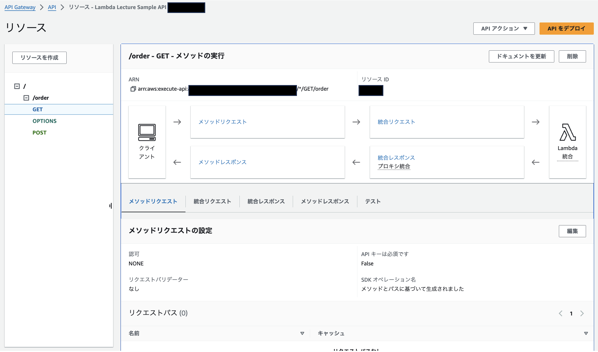
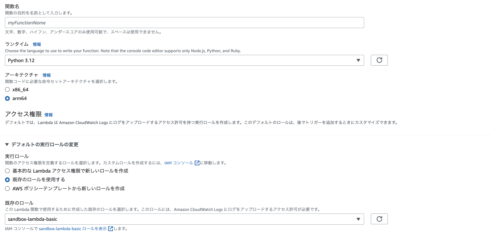
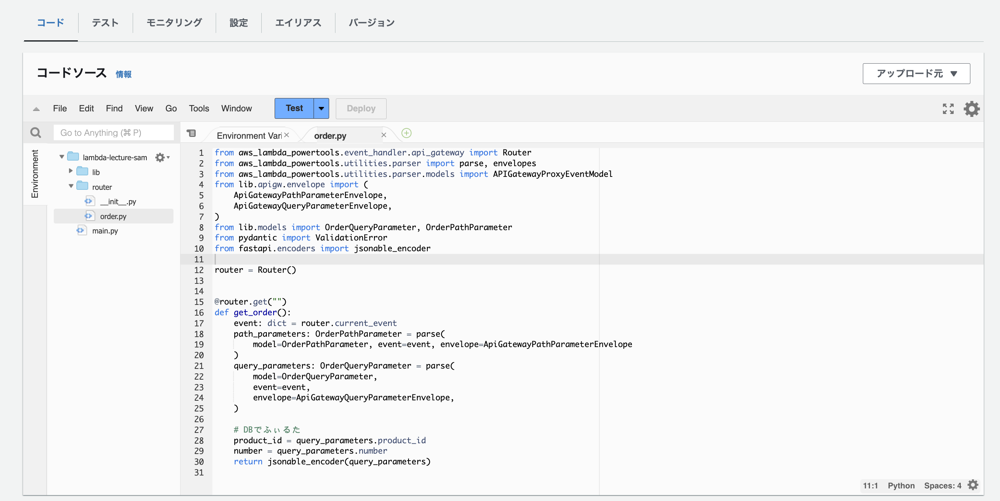
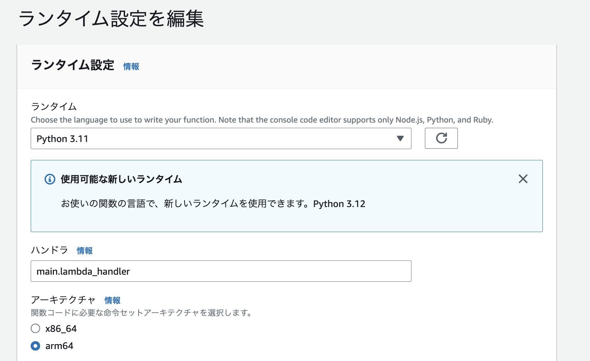
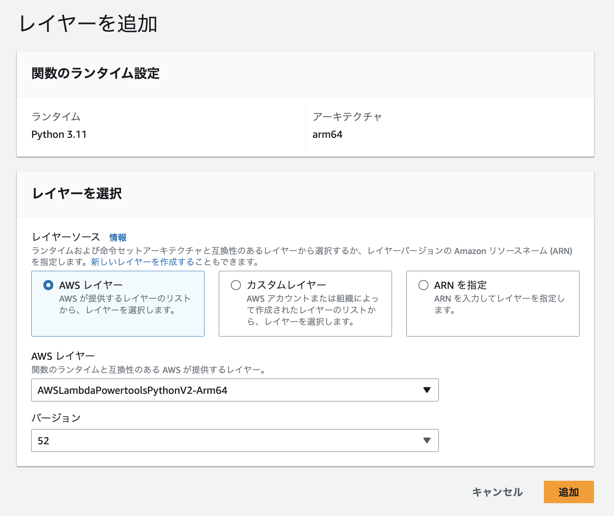
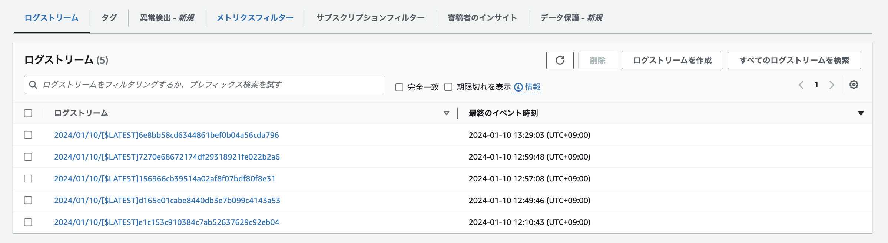
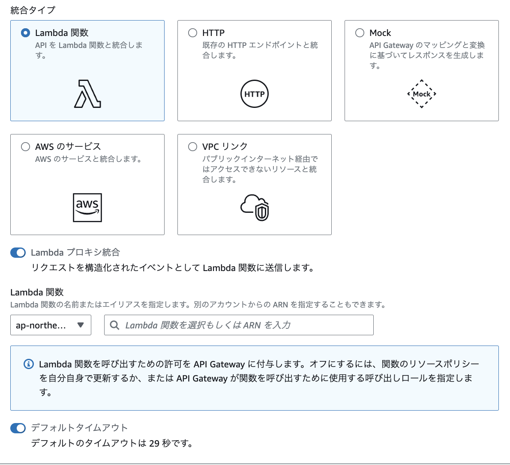
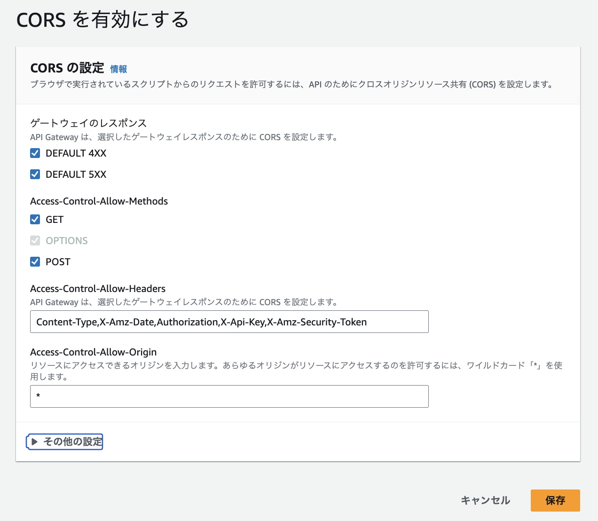
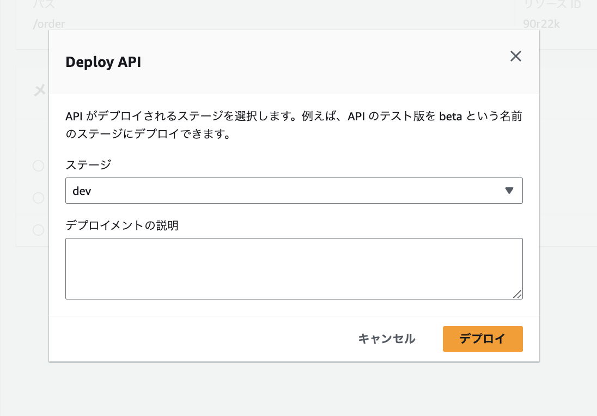
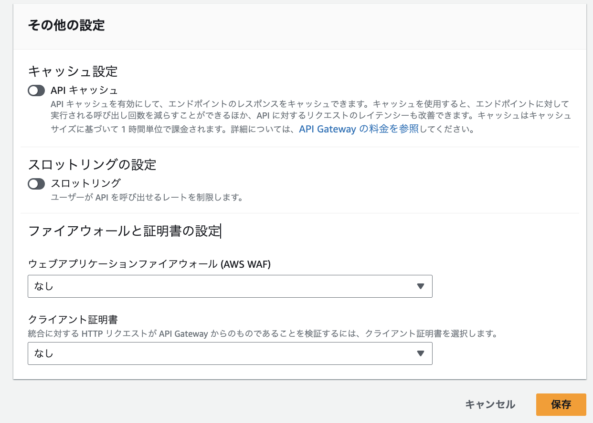

# Day4

## OpenAPI仕様書からAPIGatewayのRestAPIを作成する

### openapi.yaml の手直し

- AWSにopenapi.yamlを持っていくにあたり、複数のyamlを1つに集約する必要があります。
- 以下のコマンドで `bundled.yaml` を生成します。(redeclyコマンドはREADMEを参照して各自インストールしてください。)

```bash
redocly bundle openapi.yaml -o bundled.yaml
```

### AWSでの操作

openapi.yamlを適切に書いておくことで、AWSのAPIGatewayの設定をyamlファイルを渡すだけで完結できます。

- APIGatewayを開き、**APIを作成**をクリック
- 「API タイプを選択」で、**REST API** の **構築**をクリック
- **APIをインポート** にチェックを入れて、ファイルを選択 から 作成した `bundled.yaml` をアップロードする。
- **APIを作成** をクリックすると、openapi.yamlの定義に従ってAPIが作成されます。



## Lambdaのセットアップ

### Lambdaの作成

APIGatewayのパスに対応するLambdaを作成する必要があります。WebUIから作成していきます。

- Lambdaの画面で、**関数の作成**をクリック
- 一から作成をチェックし、関数名を入力
- ランタイムには**Python3.11**を選択
- アーキテクチャは**arm64**を選択
  - arm64の方が運用コストが安くなります。特殊なライブラリを使う際にはx86_64しか動かない場合があるので、ケースに合わせて適切なものを選択してください。
- **デフォルトの実行ロール**のトグルを開き、**既存のロールを使用する**にチェック
- 既存のロールから **sandbox-lambda-basic**を選択
  - これは事前に作成したロールです。S3やDynamoDB、CloudWatchなど開発に必要なサービスを許可しています。ケースに合わせて適切なものを選択してください。

- 右下の**関数を作成**をクリックすると、Lambdaが作成されます。

### ソースコードの更新


- ターミナル上で、以下を実行します。

```bash
cd api/
sh bundle.sh
```
- これでソースコードがzipファイルに纏められます。

- 次にAWS上での操作に移ります。
- 先程作成されたLambdaで実行されるコードを変更します。
- コードのタブが選択された状態で、**アップロード元**をクリックして、先程作成したzipファイルをアップロードします。
- するとコードが差し替わります。




### ランタイム設定

- 実行ランタイムを変更します。
  - **ランタイム**は、どのソースコードの何の関数をどのような環境で動かすのか、ということくらいの概念です。
- 画面下部のランタイム設定の編集をクリックします。
- ハンドラを `main.lambda_handler` に変更します。
  - これで `main.py` の `lambda_handler` という関数が呼び出されます。




### レイヤーの設定

レイヤーとは、実行時に必要なライブラリなどをひとまとめにしたものです。これをLambdaにアタッチすることで、ライブラリが import できるようになります。今回のレクチャーでは `aws_lambda_powertools` を利用しているため、これが搭載されているレイヤーをアタッチします。
- 画面下部のレイヤーの追加をクリックします。
- AWSレイヤーをチェックし、`AWSLambdaPowertools` のレイヤーを選択します。
- バージョンは最新のものを選択します。
- 追加をクリックすると、レイヤーが適用されます。


- レイヤーはカスタムレイヤーとして自力で作成できます。標準で用意されているもの以外のライブラリを使いたい場合、カスタムレイヤーを用意する必要があります。


ここまででLambdaの設定は完了です。


## CloudWatchLogsの設定

Lambdaのデバッグを行うにあたり、ログ設定が必須になります。CloudWatchLogsを使ってLamdbaのログを見れるようにします。

- CloudWatchを開き、左のメニューから**ログ** → **ロググループ**をクリックします。
- **ロググループを作成**をクリックします。
- ロググループ名に以下のルールでグループ名を入力します。
  - `/aws/lambda/<lambda function name>`
  - たとえば `lambda-lecture-sample` というLambdaならば、`/aws/lambda/lambda-lecture-sample` です。
- 保持期間を1週間にしておきます。
  - これはプロジェクトのポリシーに合わせて適切な期間を設定します。
- その他はデフォルトでOKです。画面下部から**作成**をクリックします。
- これでロググループが作成されます。一覧から作成されたロググループをクリックすると、Lambdaのログをログストリームとして見ることが出来ます。
  - ログストリームはLambdaが実行されたタイミングで出力されます。実行→出力までには若干のタイムラグがあります。
  - Lambdaを実行してもログストリームが出てこない場合、何らかの設定ミスがあります。



## Lambda / APIGateway の統合・デプロイ

最後にLambdaとAPIGatewayを統合し、特定のパスにアクセスした際に目的のLambdaが実行されるようにします。

- APIGatewayにアクセスし、先程作成したRestAPIを開きます。
- 左のメニューからリソースをクリックし、Lambdaとの統合を設定したいリソースおよびメソッドをクリックします。
- 統合の設定を開き、以下を設定
  - **Lambda関数**をチェック
  - **Lambdaプロキシ統合**のトグルをONにする
  - Lambda関数に、先程作成したものを選択する。
  - **作成**をクリック


ここまででLambdaとAPIGatewayが紐付けられました。次にCORS設定をします。

- 各リソースをクリックします。(例えば /order)
- リソースの詳細で、**CORSを有効**にするをクリックします。
- 下記のようにチェックを入れて、保存します。




次にAPIGatewayをデプロイします。APIGatewayに何らかの変更がかかったら、デプロイをすることで反映されます。

- 左のメニューからリソースをクリックし、APIをデプロイのボタンをクリックします。
- ステージを選択します。
  - 初めてのデプロイの場合には、New Stageを選択し、任意のステージ名を入力します。
  - 2回目以降の場合には、以前に作成したステージを選択します。
  - **デプロイ**のクリックで、APIがインターネット上に公開されます。




最後に、ACLの設定をします。インターネットに公開されたAPIが外部からの攻撃を受けないように、ACL（Access Control List）を使ってIPアドレスでアクセス元を制限します。

- 左のメニューから、**ステージ**をクリックします。
- ステージの詳細から、編集をクリックします。
- その他の設定に、ウェブアプリケーションファイアウォールがあるので、その中から 指示されたものを選択します。



- 保存をクリックして、変更を適用します。


これでAPIGatewayの設定が完了です。ステージの詳細で表示されている URLを呼び出す のURLに対してリクエストすると、結果が見れます。
もしエラーがあった場合にはCloudWatchのログを見ながら、Lambdaを修正していきます。
